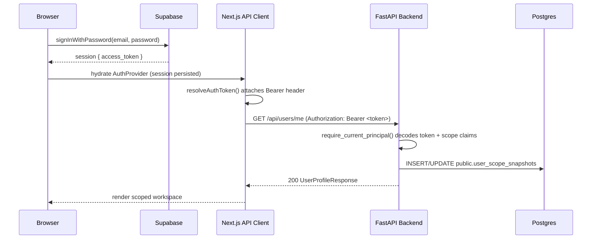

# Supabase Auth + Scope Claim Integration

## Overview

The workspace now relies on Supabase sessions for every authenticated web or API interaction. Each access token carries organization and division claims so the FastAPI backend can enforce tenant boundaries and persist the caller’s active scope for auditing.

## Token Payload Contract

- `org_id` / `orgId` – active organization when the token was minted.
- `division_id` / `divisionId` – active division inside that organization.
- `org_ids` / `orgIds` – every organization the user may access.
- `division_ids` / `divisionIds` – map of organization → visible division ids.
- The claims can live inside the root payload, `app_metadata.yourever`, or `yourever_scope`; the backend normalises every variant.

Example payload excerpt:

```json
{
  "sub": "0c7d1f9d-43b2-4f32-929e-5bf7cf1f0a10",
  "email": "alex@example.com",
  "app_metadata": {
    "provider": "email",
    "yourever_scope": {
      "org_id": "org_123",
      "division_id": "div_456",
      "org_ids": ["org_123"],
      "division_ids": {
        "org_123": ["div_456", "div_789"]
      }
    }
  }
}
```

## Request Flow



## Backend Changes

- `CurrentPrincipal` now exposes `active_org_id`, `active_division_id`, `org_ids`, `division_ids`, and preserves the raw claim payload.
- Each authenticated request records the latest scope snapshot in `public.user_scope_snapshots` via `UserRepository.record_scope_snapshot`.
- A migration (`backend/app/db/migrations/20251018_create_user_scope_snapshots.sql`) creates the snapshot table plus indexes for org/division lookups.

## Supabase Configuration Checklist

1. **JWT Secret & Audience**
   - Ensure `SUPABASE_JWT_SECRET` and (optionally) `SUPABASE_JWT_AUDIENCE` are set in FastAPI/Next.js environments.
2. **Custom Access Token Claims**
   - Add a Postgres trigger or Edge Function that updates `auth.users.raw_app_meta_data` during sign-in:

     ```sql
     -- Example helper: call from trigger to refresh scope claims
     update auth.users
     set raw_app_meta_data = jsonb_set(
       coalesce(raw_app_meta_data, '{}'::jsonb),
       '{yourever_scope}',
       jsonb_build_object(
         'org_id', current_org_id,
         'division_id', current_division_id,
         'org_ids', accessible_org_ids,
         'division_ids', accessible_division_map
       )
     )
     where id = auth.uid();
     ```

   - Replace `current_org_id`, `accessible_org_ids`, etc. with queries that read from `org_memberships` and `division_memberships`.
3. **Session Persistence**
   - The frontend AuthProvider already persists Supabase sessions (see `src/contexts/auth-context.tsx`); no further changes required.
4. **Testing**
   - Log in as a user with multiple organizations, switch divisions, and verify `public.user_scope_snapshots` reflects the latest selection.
   - Confirm all API responses continue to include tenancy-aware payloads.

## Rollout Notes

- Feature flags: none required; Supabase mode is now the default.
- Backfill: run the migration and then execute a one-time job to seed `user_scope_snapshots` by replaying recent login events or iterating through memberships.
- Monitoring: track `users.scope_claims.*` log lines for serialization issues and set up alerts if scope snapshots fail to update.
